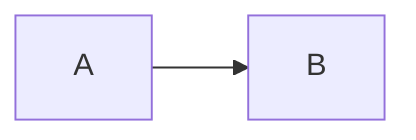

+++
title = "加密文章示例 — 需要密码才能阅读"
date = 2026-09-02
description = "演示文章加密功能"
[taxonomies]
categories = ["SECRET"]
tags = ["encrypt", "demo"]

[extra]
encrypted = true
password = "elysia"
password_hint = "和 key 相同"
+++

这是加密的正文，只有输入正确密码（`123456`）后才会显示。

## 隐藏内容

恭喜你解锁了！这里可以看到：

- 支持所有 Markdown 与组件
- 代码块：

```js,linenos,name=secret.js
const secret = "Elysia 🔐";
console.log(secret);
```

> [!IMPORTANT]
> 加密仅为静态站点的轻量混淆，不适合高度敏感信息。


密码别名通过 front matter 的 `extra.password` 配置（如 `key1`），真密码只存放在加密脚本的 `encrypt.toml` 中；构建后脚本对正文做 AES-GCM 加密，前端解密。适合简单的访问控制。




